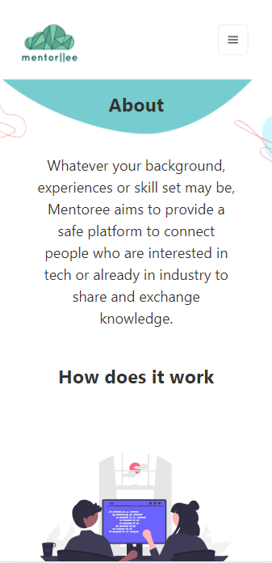

# Mentoree

Welcoming to Mentoree, a tech Mentoring App which connects people and enables growth. Mentoree was created as part of a 4 week project for the School Of Code Bootcamp in February - March 2022 by ChunWai Lo, Fatou Cham, Goyas Miah, Novel Alam, Scott Brown, and Simon Prato. Our brief was to use some of the skills we had learned on the bootcamp to create a full-stack application that would solve a real world problem.

## The Problem

The recent global pandemic has seen more people seek out coding courses as a means of upskilling and future-proofing themselves in times of economic uncertainty. People are trying to self teach code, but it becomes difficult when you don’t have the guidance or support to push you in the right direction.

New coders use online resources the most when they're learning to code. Online communities can help, but they tend to be made up of other people who are also learning to code, and can lack the context and experience of someone with real world experience in the tech industry. At School Of Code we are incredibly lucky to have access to a mentor from day 1, but for self taught people, finding a mentor can be a daunting task. Many people simply don’t know anyone in the tech industry and are apprehensive about reaching out to strangers. Through our own market research we found that 93% of people would like to seek a mentor had it not been provided by the School of Code, and for those already in the tech industry who we interviewed, they saw mentorship being highly beneficial for those who want to get into the industry as well as for their own development. That’s where Mentoree comes in, an app where people can come together in a transfer of skills and knowledge between mentors in industry and mentee’s looking for guidance in their tech journeys.

## Process and planning

The main tool we used for organising and planning our work was Trello. We used the kanban framework for real-time communication and full transparency of our work and made sure that communication was clear by coming together regularly throughout the day to check up on each other. Daily standups were done at the start of the day to reflect and plan out our goals and what we hope to achieve for the day. At the end of the day retrospectives were carried out to review how the day went for everyone, what went well, and the things we could’ve improved on.

We made a plan of what we wanted in the app using Disney Ideation to brainstorm what we would like the app to be like, what would be realistic to achieve and any critiques. Research on existing mentoring platforms was carried out to get inspiration and see key differences and similarities. Our main USP is that we are a community-based, free platform. After brainstorming and utilising the Disney Ideation process we decided on our app.

User Personas/User Stories were created based on the different perspectives and needs of those looking to enter the tech industry and others who are already in it.

### Research

Two questionnaires were sent out to potential mentees and mentors, where we also mapped out the workflow to help identify the high-priority stories. Interviews were carried out with our own mentors and School of Code’s community manager who deals with recruiting mentors for School of Code to gain a better understanding of the processes of becoming a mentor and how they decided to match mentees.

## Design

So why did we call ourselves Mentoree ? Well the reason behind this was because as you can see, we have an “or” operator within our logo, so as a clever play on words it would mean Mentor or Mentee.

After several logo design iterations, we decided on this final one, where the cloud represents a dream, something you aspire to want to happen and we believe this encapsulates exactly what Mentoree really is, turning those dreams into a reality through the art of mentorship. Another interpretation is the exchange of information and knowledge through the cloud, and the lines being the linkage between people wanting to connect with one another.

We decided on a minimalist design with simple shapes and images, and neutral pastel colours for a welcoming and calm feeling. Rounded off shapes, cards and buttons were used to project a positive emotional message, and the use of circular shapes suggest community, friendship and unity. The colour theme was used to showcase a friendly environment and a sense of calm and peace, which is what we envision Mentoree to be for both mentors and mentees. We hope that the overall theme and design would reduce the overwhelming feeling that one may have trying to enter the tech industry by having a less boxy and rigid design.

We also thought about accessibility and SEO, by adding alt text to images and also metadata. In a future iteration we would like to add a dark mode as it’s easier to the eye.

We researched various UI libraries and decided on using Chakra UI because of the ease of styling, the beautiful designs, the ability to manipulate CSS classes and just the scalability it provides really. We found Ant Design to have limited styling and customisation while MUI had far more classes and caused friction against base styles when customising the interface.

We used Figma for our wireframing and sketched out our architecture and routes. It helped with the development of the more detailed final design such as positioning of elements and site navigation.

## Tech Stack

In relation to our tech stack, we decided to use next.js - mainly because we wanted to make use of the feature that Next gives, which is the possibility to use server-side rendering and static rendering. This makes it possible to create a kind of hybrid application that uses static site rendering for most pages, and server-side rendering for others.

Another feature that we were interested in using was the possibility of building and handling our API in the same application, instead of making a completely separate server.

We used PostgreSQL for our database because we thought the SQL structure was ideal for the data we want to store and handle, and Postgres specifically because it is open source.

For authentication we used a third-party provider, Firebase. Although we had used Auth0 on the bootcamp, we wanted to learn and experiment with a different tool, and we found Firebase to be a good choice for our project.

To host our app we used Netlify, as we don't have an API that requires a long-running server, so the serverless option of Netlify was a good option. And secondly because we are using a free-tier and Netlify has a faster spin up server than other similar options such as Heroku.

## Reflections

We learnt a great deal from these 4 weeks as a team. One key thing we will take away is to implement testing from the start. We decided to work on testing in the middle of our project, which added unnecessary difficulty and is something we will definitely rectify in our future projects.

Another key reflection was definitely time management and the ability to make decisions quickly to save time and provide better structure and goals for individuals and teams and to allow them more time to complete their objectives.

## What's next?

During our planning process, we had spoken of various ideas or features that we wish to add to our app if we did have time at the end of our MVP. We will now look to iterate upon our app in our spare time.  
Some of these features include:

- A Live chat that will allow the mentors and mentees to communicate directly through the app instead of using external communication methods, which would’ve been completed had we had an extra 2/3 days.

- A Booking calendar is another feature we wish to implement into the app, this will allow the mentors and mentees to put in their availability.

- An Events section which will showcase different tech related events going on around different areas.

- We also wish to build a mobile version of our app in React Native.

If you've made it this far, thanks for reading! We hope you've enjoyed our app, and have learned something about our journey and the experience gained from working on this project,

Team Mentoree - ChunWai, Fatou, Goyas, Novel, Scott, Simon

